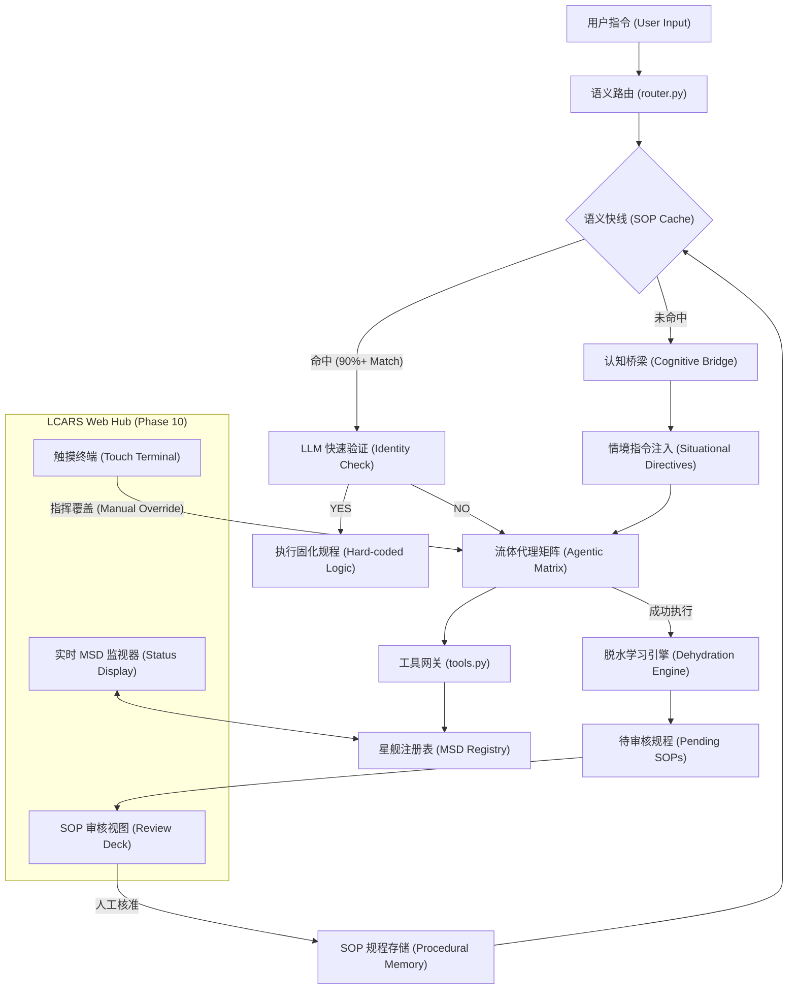

# Starfleet ADS Core Evolution: 8.0 - 9.0 架构蓝图

> **愿景**: 在冰冷的代码逻辑（骨架）与流动的 AI 灵活性（灵魂）之间建立动态平衡，实现一个“赋能而非喂养”、具备自我进化能力的星舰中枢。

---

## 1. 宏观架构概览 (Macro Architecture)



---

## 2. ADS 8.0: 骨架重塑 (The Precision Infrastructure)
**核心目标**: 强化代码约束，实现“按需供给”，减少 LLM 接收到的数据噪声。

### 部门化权限隔离 (Departmental Throttling)
- **精准过滤**: `get_status` 不再返回全量 JSON。
- **逻辑分层**: 
    - `Engineering`: 限定为动力、能源、结构。
    - `Tactical`: 限定为武器、护盾、外传。
    - `Operations`: 限定为通信、转运、内应。
- **物理约束强制化**: 指标联动逻辑下沉至 `ship_systems.py` 内核，LLM 仅能观察结果，无法篡改物理常数。

---

## 3. ADS 9.0: 灵魂进化 (The Evolutionary Nexus)
**核心目标**: 实现自适应学习循环，将 LLM 的即时智慧转化为系统的永久经验。

### 语义快线与 SOP 缓存 (Semantic Fast-Path)
- **模糊匹配层**: 使用 `difflib` 或小型 Embedding 计算指令。
- **脱水学习 (Dehydration)**: 
    - 异步任务监听成功的复杂操作。
    - 将对话中的“废话”剔除，保留核心 `tool_chain` 指令序列。
    - **示例**: 将“快点扫描左右两侧并报告”脱水为 `{"trigger": "scan_local", "steps": ["sensor_manager.scan", "get_status:scope=tactical"]}`。

### 情境指令注入 (Situational Awareness)
- **副舰长模式**: 系统检测到“关键事件”（如：传感器发现目标、能源跌至 15%）时，主动在 System Prompt 首行注入 **[EXECUTIVE DIRECTIVE]**。
- **引导思维**: 强制 AI 知道“现在该做什么”，而不是等用户问。

---

## 4. 技术实施路线图 (Roadmap)

| 阶段 | 模块 | 核心改动点 |
|---|---|---|
| **Phase 8.1** | 数据节流 | `tools.py` 引入 `scope` 参数 |
| **Phase 8.2** | 认知引导 | `dispatcher.py` 注入 `SituationalDirectives` |
| **Phase 9.1** | 语义快线 | 实现 `SOP_CACHE.json` 检索与 LLM Identity Check |
| **Phase 9.2** | 自主归档 | 完善 `NeuralEvolutionAgent.dehydrate_process` |

---

---

## 5. 深度自查与边界条件分析 (Self-Correction Loops)

### Loop 1: 语义碰撞与知识陈旧 (Context Collision)
- **风险**: 快速匹配可能因“语义过于接近”而误触发错误的规程。
- **强化方案**: 
    - **双重校验机制**: 语义匹配仅作为“建议”，在执行前必须通过 LLM 的 `Identity Filter`。
    - **向量空间隔离**: 为不同部门（战术、工程）建立独立的 SOP 向量仓库。
- **应对方案**: 引入 `SOP_VERSION`。每当底层代码（tools.py）重大更新，全量清空或重验证旧版 SOP。

### Loop 2: 意图篡改与安全 (Security & Prime Directive)
- **风险**: 通过多轮对话“诱导” AI 存储具有安全风险的 SOP（如：绕过权限检查）。
- **强化方案**: 
    - **内核权限固定**: 代码层 (`tools.py`) 的 `clearance` 检查是物理硬连线的，SOP 只能简化调用链，无法提升权限。
    - **行政等级制度**: 新学习的规程默认为 `DRAFT` 状态。只有副舰长（用户本人）下达 `COMMIT_SOP` 指令，该过程才具有永久执行权。

### Loop 3: 认知膨胀与资源管理 (Neural Pruning)
- **风险**: 随着学习数据增加，检索慢、消耗大。
- **强化方案**: 
    - **热度算法**: `Score = (SuccessRate / Age) * Frequency`。
    - **自动剪枝**: 每 48 小时执行一次后台审计，将低评分 SOP 转化为冷数据（Dehydrated Text Only），不占活性能量。

---

## 6. 特化：脱水学习 (Dehydration) 的高级逻辑

**脱水过程示例**:
1. **原始踪迹 (Raw Trace)**: 用户：“哎呀，那边好像有艘未知克林贡星舰，隐约看到相位阵列，快用长程传感器扫描，锁定它，然后准备光子鱼雷，随时待命。”
2. **脱水 LLM (Dehydration LLM)**: 提取核心动作，剔除干扰语气。
3. **结构化规程 (Structured SOP)**:
```json
{
  "intent_id": "TAC_SCAN_READY_001",
  "tags": ["sensor", "tactical", "combat_ready"],
  "conditions": ["target_detected"],
  "workflow": [
    {"tool": "get_mission_logs", "args": {"keyword": "Klingon"}},
    {"tool": "tactical_execute", "args": {"action": "LOCK", "target": "$ENTITY"}},
    {"tool": "tactical_execute", "args": {"action": "ARM", "weapon": "photon_torpedo"}}
  ],
  "author_id": "User_01",
  "confidence": 0.05
}
```

---

## 7. 情境感知 (Situational Awareness) 的自愈逻辑
如果 LLM 在带有 **[EXECUTIVE DIRECTIVE]** 的提示下仍然执行了错误的工具（例如：在被要求扫描时去查了相位炮寿命），系统将触发：
1. **反向阻断**: 代码层拒绝该执行。
2. **认知重置**: 强制清除本轮迭代的上下文，重新发送极简化的“紧急指令”，消除 LLM 的思维惯性。
