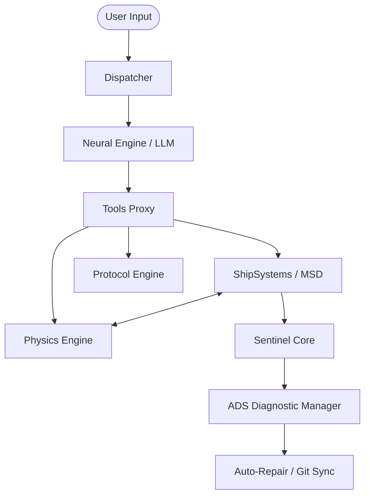

# Federation Technical Manual: StarTrekBot Advanced Systems Audit

This document serves as the authoritative record of the logic, architecture, and physics models integrated into the StarTrekBot. It is intended for use by engineering personnel to ensure system consistency and facilitate future optimizations.

## 1. System Architecture Overview

The bot follows a **Modular Sentinel Architecture**, where core functionality is distributed across specialized engines that interact via a centralized Signal Hub.

## 2. Core Subsystems

### 2.1 MSD (Master Systems Display) & Registry
- **Path**: `services/bot/app/ship_systems.py`, `config/msd_registry.json`
- **Logic**: A hierarchical tree representing every ship component.
- **Key Features**:
    - **State Management**: Each component has a state (`ONLINE`, `STANDBY`, `OFFLINE`, `DAMAGED`).
    - **Metric Mapping**: Quantitative values (e.g., Reactor Power, Shield % ) are linked to component status.
    - **Alias Learning**: Dynamically learns new terms (e.g., `main_odn` -> `odn`) and persists them to the registry.

### 2.2 Physics Engine (ADS 7.1)
- **Path**: `services/bot/app/physics_engine.py`
- **Logic**: Implements "Universal Laws" that govern system interactions.
- **Integrated Models**:
    - **EPS Load Shedding**: Automatically prioritizes power to critical systems (Life Support, Shields) when reactor output drops.
    - **Subspace Decay**: Models signal degradation over distance (22.65ly threshold).
    - **NDF Clause**: Defines the nuclear disruption effects of Level 12+ Phaser strikes.
    - **Proximity Interference**: Models Deflector-to-Sensor blind spots.

### 2.3 Sentinel Core (S.E.S.M.)
- **Path**: `services/bot/app/sentinel.py`
- **Logic**: An autonomous monitoring layer that triggers actions based on state changes.
- **Triggers**: Monitors "Logic Genes" to detect anomalies or situational requirements (e.g., "Red Alert" protocols).

### 2.4 ADS (Auto-Diagnostic Subroutine)
- **Path**: `services/bot/app/diagnostic_manager.py`
- **Logic**: Detects, diagnoses, and repairs system errors.
- **Recovery Flow**:
    1. **Catch**: Intercepts Exception/Fault.
    2. **Diagnosis**: Uses Neural Engine to analyze logs.
    3. **Repair**: Applies hot-fixes or triggers Git Sync for persistent recovery.

## 3. Communication Protocols
- **OneBot 11**: Standard bridge to NapCat.
- **Endpoint**: `http://napcat:3000/api/send_group_msg`.
- **Security**: Bearer Token authentication (as defined in `ConfigManager`).

## 4. Maintenance & Evolution
- **Config Persistence**: Handled by `ConfigManager` with case-insensitive field matching.
- **Neural Sync**: Automatic GitHub synchronization for learned aliases and rules.

---
*Authorized by Starfleet Command. LCARS v4.2 Internal Audit.*
