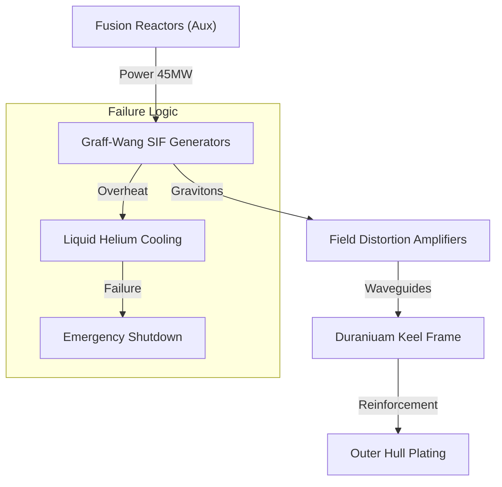

# STARFLEET COMMAND - MARS STATION DEFENSE (MSD)
## VOL 01: STRUCTURAL ENGINEERING & GEOMETRY (EXTENDED)
**Classification: SECRET / EYES ONLY**
**Date:** Stardate 99245.3
**Authored By:** SCE (Starfleet Corps of Engineers) - Utopia Planitia Division

> [!IMPORTANT]
> **SIMULATION PROTOCOL**
> This document overrides all previous structural summaries.
> It defines the physical existence of Station MSD in the Areostationary orbit.
> **Mass**: 125,402,000 Metric Tonnes.
> **Volume**: 8.24 Billion Cubic Meters.
> **Deck Count**: 150.

---

## 1.0 STRUCTURAL SYSTEM ARCHITECTURE

### 1.1 FRAMEWORK COMPOSITION
The station's primary skeleton uses a **Duranium-Tritanium Micro-Lattice**.
*   **Alloy Ratio**: 62% Duranium / 30% Tritanium / 8% Carbon-Nanofiber mesh.
*   **Thermal Properties**: The frame is designed to dissipate Phaser heat via **thermal superconductivity**, spreading a 5000°C point-impact across 400 square meters of hull to prevent vaporization.
*   **Sensor Interference**: Due to the Duranium content, internal comms requires **RF-Repeaters** every 50 meters (Deck intervals).

### 1.2 EXTERNAL PLATING (ARMOR)
The outer skin is not merely a wall, but an active defense layer.
*   **Ablative Armor**: 12cm High-Density Ablative Armor (HDAA).
    *   *Function*: Designed to boil away under directed energy fire, carrying heat away from the critical frame.
    *   *Life*: Can withstand ~4 minutes of continuous Type-X Phaser fire before exposing the frame.
*   **Polarized Hull**: In combat, the hull plates are electrically charged (Polarized) to repel ionic particles and dissipate plasma splash.

---

## 2.0 STRUCTURAL INTEGRITY FIELD (SIF)

Station MSD is too massive to support its own structure under standard gravity or inertial maneuvers without artificial reinforcement.

### 2.1 GENERATOR SPECIFICATIONS
*   **Primary Unit**: 5x **Graff-Wang Field Generators** (Deck 85).
    *   **Components**: Each unit contains twenty 12MW **Graviton Polarity Generators**.
    *   **Output**: Feeding two 250-millicochrane Field Distortion Amplifiers.
    *   **Cooling**: Continuous-duty **Liquid Helium Loop**, dissipating 300,000 MJ/hr.
    *   **Duty Cycle**: 36 hours ON / 24 hours OFF (Rotational maintenance).

### 2.2 FIELD DYNAMICS
*   **Standard Frequency**: 144 Hz (Anti-Gravity support).
*   **Combat Frequency**: 256 Hz (To counter Graviton Torpedo shear).
*   **Physics Logic**:
    *   The SIF effectively increases the *tensile strength* of the Duranium frame by **125,000%**.
    *   If SIF drops below **15%**, the station's lower reactor core will shear off under its own weight.

---

## 3.0 INERTIAL DAMPING FIELD (IDF)

Even though MSD is a station, Newton's Laws apply. When a 50-kiloton Runabout lands, the momentum transfer would shatter windows without IDF.
*   **Lag Time**: 350ms.
*   **Effect**: This quarter-second lag is why crew members stumble during impact events. The IDF system needs time to calculate the counter-force vector.

---

## 4.0 MASTER DECK LISTING (DETAILED)

The station is vertically organized into 150 decks.

### SECTION I: COMMAND SPIRE (Decks 1-10)
*   **Deck 1**: **Main Operations (Ops)**. The "Bridge" of the station.
    *   * Facilities*: CO Ready Room, Main Viewscreen, Tactical Pit (Master Systems Display).
*   **Deck 2**: Senior Officer Quarters, Diplomatic Reception Hall.
*   **Deck 3**: VIP Guest Suites, Conference Lounge A/B.
*   **Deck 4**: **Subspace Communications Array** (Physical Transceivers).
*   **Deck 5-8**: Stellar Cartography, Astrophysics Labs, Upper Sensor Palette Access.
*   **Deck 9**: Security Complex (Holding Cells, Armory A).
*   **Deck 10**: Combat Information Center (CIC) - Used only during "Condition Red".

### SECTION II: HABITAT RING (Decks 11-30)
*This section rotates at 1.2 RPM for auxiliary gravity backup (rarely used).*
*   **Deck 11**: **Promenade Upper Level**.
*   **Deck 12**: **Promenade Main Level**.
    *   *Facilities*: Replimat, Templar's Bar, Holosuites 1-6, Schoolroom.
*   **Deck 13**: Infirmary (Main Sickbay), CMO Office, Surgical Suites 1-4.
*   **Deck 14**: Science Labs (Biology, Xenobotany).
*   **Deck 15-25**: Crew Quarters (Junior Grade to Enlisted).
*   **Deck 26**: Gymnasium, Arboretums.
*   **Deck 27**: Independent Life Support (O2 Scrubbers for Hab Ring).
*   **Deck 28-30**: Deuterium Fuel Storage (Upper Primary Tank).

### SECTION III: ENGINEERING DISC (Decks 31-80)
*   **Deck 31**: **Main Engineering (Upper Access)**.
*   **Deck 32**: Chief Engineer's Office, Dilithium Control Room.
*   **Deck 33-40**: **Computer Core A & B** (Two-story cooling towers).
*   **Deck 41**: Industrial Replicators (Cargo grade).
*   **Deck 42**: **Main EPS Power Taps** (The "Heart" of the electrical grid).
*   **Deck 45-60**: General Cargo Bays 1-12.
*   **Deck 61-70**: **Phaser Capacitor Banks** (Storing energy for the 1440 banks).
*   **Deck 75**: Turbolift Maintenance Hub.
*   **Deck 80**: Engineering Support Labs.

### SECTION IV: REACTOR CORE COLUMN (Decks 81-120)
*   **Deck 81**: **Magnetic Constriction Generators (Upper)**.
*   **Deck 85**: **SIF / IDF Generator Complex**.
*   **Deck 90-100**: Matter Injector Assembly.
*   **Deck 102**: **THE INTERMIX CHAMBER** (Dilithium Crystal Housing).
*   **Deck 110-115**: Antimatter Injector Assembly.
*   **Deck 120**: **Antimatter Storage Pods** (Ejectable).

### SECTION V: HANGAR & LOWER PYLON (Decks 121-150)
*   **Deck 121**: **Main Shuttlebay Flight Deck**.
*   **Deck 122**: Runabout Maintenance Pads (Yellow River Class servicing).
*   **Deck 125**: Flight Control (Air Traffic).
*   **Deck 130**: Lower Sensor Palettes.
*   **Deck 140**: Tractor Beam Emitters (Primary Towing).
*   **Deck 145**: Waste Processing & Recycling.
*   **Deck 150**: **Plasma Exhaust Vent** (Nadir point of station).

---

## 5.0 JEFFERIES TUBE PROTOCOLS

Crew access to systems is provided by **Jefferies Tubes** (Service Crawlways).

### 5.1 JUNCTION LABELING (GNDN Standard)
All junctions must be labeled with the following code format:
`[DECK]-[SECTION]-[TUBE#]` -> Example: `042-SEC12-J05`
*   **Red Label**: High Energy Plasma (EPS). **LETHAL**.
*   **Blue Label**: Optical Data Network (ODN). Fragile.
*   **Yellow Label**: Life Support / Atmosphere.
*   **Green Label**: Coolant / Water / Waste.

### 5.2 SAFETY INTERLOCKS
*   **Vertical Hatches**: Must prevent free-fall. Equipped with magnetic ladders.
*   **Seals**: Every 10 meters, a **Blast Shutter** can seal the tube in case of hull breach.

---

## 6.0 TURBOLIFT NETWORK

*   **Vertical Shafts**: 01 (Ops Root), 02 (Hab Ring), 03 (Eng Core).
*   **Horizontal Shafts**: Connecting the Pylons and Disc.
*   **Speed**: 10 m/s (Standard) / 25 m/s (Emergency Flush).
*   **Emergency Mode**: In "Condition Red", Turbolifts skip all stops except Bridge, Engineering, and Sickbay.

---

> **NEXT VOLUME**: [02_Power_Extended.md](file:///Users/wanghaozhe/.gemini/antigravity/brain/043b8282-3619-44f4-9467-95077493a8b7/msd_knowledge_base/02_Power_Extended.md)
