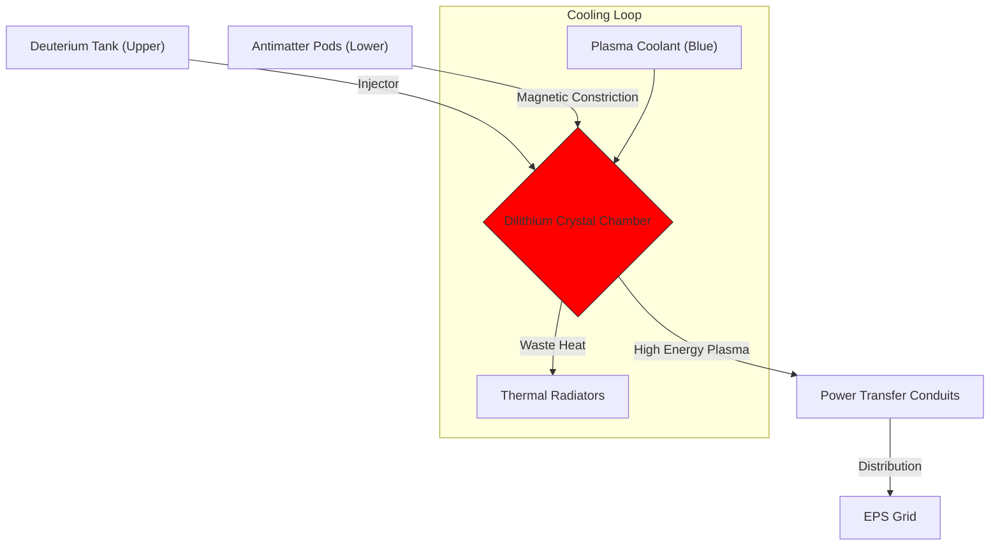

# STARFLEET COMMAND - MARS STATION DEFENSE (MSD)
## VOL 02: PROPULSION & POWER SYSTEMS
**Classification: SECRET**
**English Language Standard**

> [!NOTE]
> This module details the energetic heart of MSD: The Matter/Antimatter Reaction Assembly (M/ARA) and the Electro-Plasma System (EPS).

---

## 2.1 MATTER / ANTIMATTER REACTION ASSEMBLY (M/ARA)
Station MSD is powered by a **Class-12 M/ARA Core**. Unlike starship cores which are horizontal or compact, this core spans **40 vertical decks (86-120)**.

### The Intermix Cycle
1.  **Reactants**:
    *   **Matter**: Deuterium (stored in upper cryogenic tanks).
    *   **Antimatter**: Anti-Hydrogen (stored in magnetic pods at the keel bottom).
2.  **Injection**:
    *   MRI (Matter reactant injector) fires from the top.
    *   ARI (Antimatter reactant injector) fires from the bottom.
3.  **Collision**: The streams meet in the **Dilithium Articulation Frame**. The crystal porosity allows the streams to pass through, rectifying the annihilation energy into a coherent plasma stream.
4.  **Ratio**:
    *   **1:1**: Standard output.
    *   **10:1**: Idle / Fusion-dominant mode.

### 2.2 FAILURE MODES (Simulation Logic)
*   **Coolant Leak**: If the blue coolant line ruptures, the Dilithium will overheat.
    *   *System Response*: Automatic SCRAM (Emergency Shutdown).
    *   *Bot Dialogue*: "Warning: Coolant pressure dropping. Core temperature rising above 2 million Kelvin."
*   **Containment Breach**: Magnetic constriction failure.
    *   *Result*: Antimatter touches the containment wall.
    *   *Time to Boom*: 5 minutes standard.
    *   *Solution*: **Eject Protocol**.

---

## 2.3 ELECTRO-PLASMA SYSTEM (EPS)
The EPS grid distributes the raw plasma from the core to end-users. It is analogous to the "blood vessels" of the station.

### Tier Structure
| Tier | Description | Max Load | Users |
| :--- | :--- | :--- | :--- |
| **Tier 1 (Microwave)** | Heavy shielding, direct plasma tap. | 8000 TW | Phasers, Shields, Deflectors |
| **Tier 2 (Magnetic)** | Step-down transformers. | 500 TW | Computer Cores, Transporters |
| **Tier 3 (Copper/Optic)** | Standard electricity. | 50 kW | Lights, Replicators, Gravity |

### Power Shunting Logic
When tactical demand spikes (e.g., "Fire Phasers!"), the computer considers **Shunting**.
1.  **Priority 1**: Life Support (Never Cut).
2.  **Priority 2**: Shields (Cut only if empty).
3.  **Low Priority**: Holodecks & Replicators.
    *   *Bot Logic*: If Phaser demand > Available Power, the Bot automatically executes: `Disable_System(Replicators)`.

---

## 2.4 AUXILIARY FUSION
*   **Generators**: 12x Impulse-style Fusion Reactors on the Habitat Ring edge.
*   **Purpose**: Back-up power. Even if the Core is ejected, these can keep the "Lights On" and SIF at 15%. They cannot power the main Phaser Banks.

---

> **DATA ACCESS**: For Tactical systems powered by this grid, see [03_Tactical.md](file:///Users/wanghaozhe/.gemini/antigravity/brain/043b8282-3619-44f4-9467-95077493a8b7/msd_knowledge_base/03_Tactical.md).
